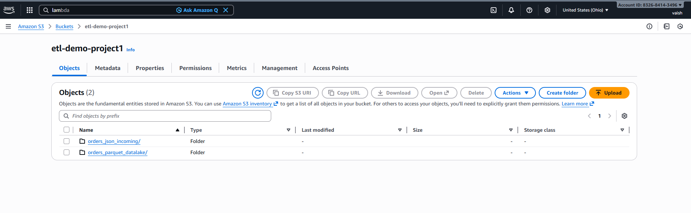
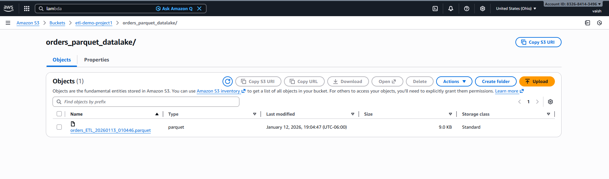
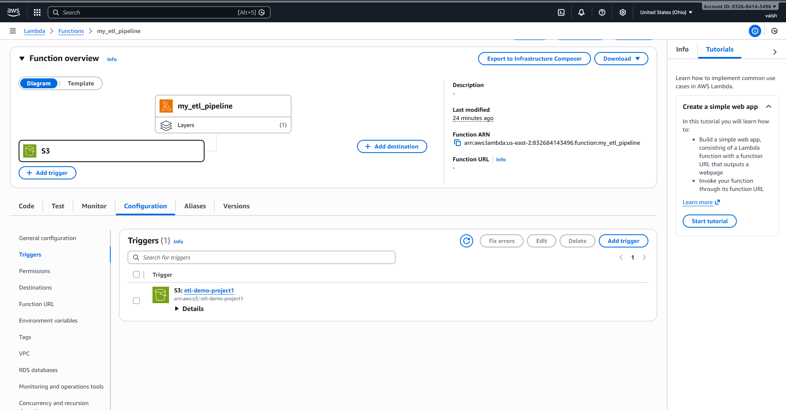
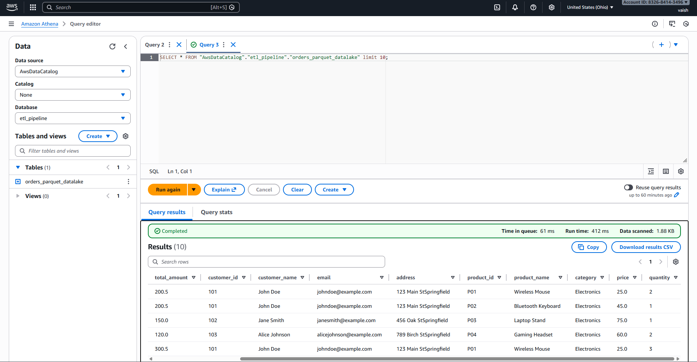
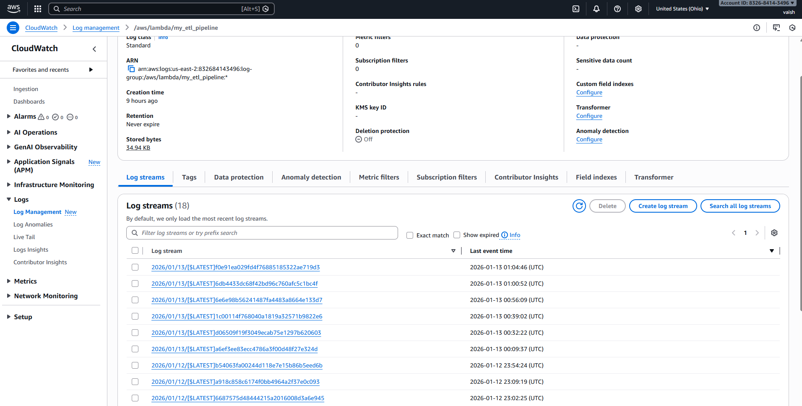

# AWS ETL Analytics Pipeline

## Project Overview
This project demonstrates a serverless ETL pipeline on AWS that ingests nested JSON data from Amazon S3, transforms it using AWS Lambda, stores analytics ready data in Parquet format, catalogs it using AWS Glue, and enables SQL-based analytics using Amazon Athena.

This project is designed to showcase real-world data analytics and data engineering skills using a modern cloud-native architecture.

---

## Architecture
**Flow:**
1. JSON files uploaded to Amazon S3
2. S3 event triggers AWS Lambda
3. Lambda flattens nested JSON data
4. Transformed data is written to S3 in Parquet format
5. AWS Glue crawler catalogs the data
6. Amazon Athena queries the dataset using SQL

---

## Tech Stack
- Amazon S3 – Data ingestion & storage  
- AWS Lambda (Python 3.10) – Serverless data transformation  
- AWS Glue – Metadata catalog & schema inference  
- Amazon Athena – SQL analytics  
- Pandas & PyArrow – Data processing  
- Amazon CloudWatch – Logging & monitoring  

---

## S3 Bucket Structure
etl-demo-project/
├── orders_json_incoming/
│   └── orders_sample.json
├── orders_parquet_datalake/
│   └── orders_etl_output.parquet


---

## ETL Logic
- Parses S3 event metadata to identify uploaded files
- Reads nested JSON order data from S3
- Flattens order and product relationships
- Converts structured data to Parquet format
- Stores optimized Parquet files back to S3
- Updates AWS Glue Data Catalog using a crawler

---

## Glue Table Schema
| Column Name | Data Type |
|------------|----------|
| order_id | int |
| order_date | string |
| total_amount | double |
| customer_id | int |
| customer_name | string |
| product_id | string |
| product_name | string |
| category | string |
| price | double |
| quantity | int |

---

## Sample Athena Query
```sql
SELECT order_id, product_name, price, quantity
FROM analytics.orders_parquet_datalake
LIMIT 10;
```

## **Key Learnings**
- **Serverless ETL Design:** Built an end-to-end AWS ETL pipeline using S3, Lambda, Glue, and Athena  
- **Data Transformation:** Converted nested JSON data into analytics-ready Parquet format  
- **Schema Management:** Used AWS Glue crawlers for automated schema inference  
- **Analytics Enablement:** Enabled efficient SQL-based querying using Amazon Athena  
- **Debugging & Optimization:** Resolved Lambda runtime and dependency issues  

## **Future Enhancements**
- **Partitioning:** Partition Parquet files by date for improved query performance  
- **Reliability:** Add error handling and dead-letter queues (DLQ)  
- **Infrastructure as Code:** Automate deployments using Terraform  
- **Data Quality:** Implement data validation using AWS Glue Data Quality

## 📸 AWS ETL Pipeline Screenshots

 ### 🗂️ S3 Bucket Structure


### 📦 Parquet Output in S3


### ⚙️ Lambda S3 Trigger


### 📊 AWS Glue Table Schema


### 🔍 Athena Query Result


### 📝 CloudWatch Logs


